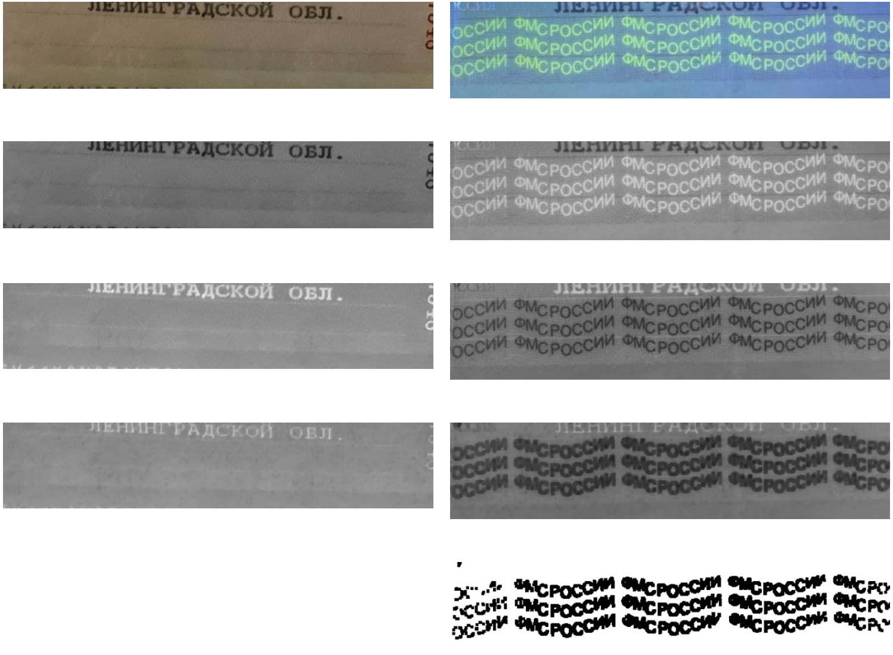
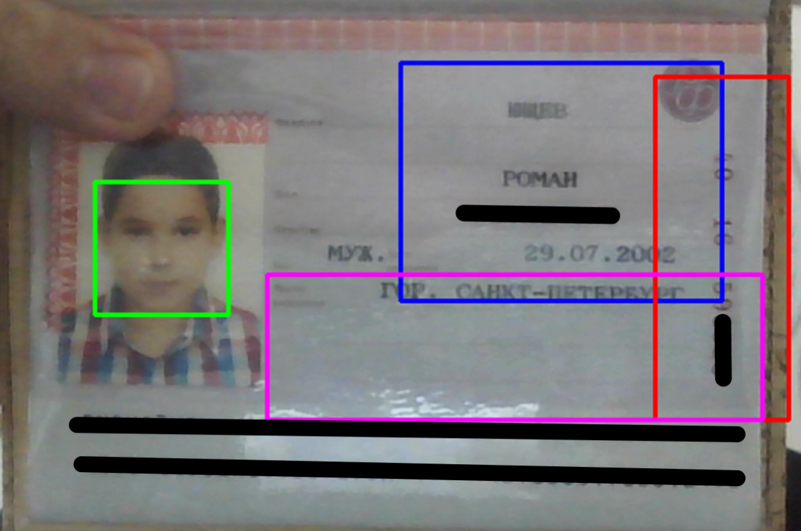
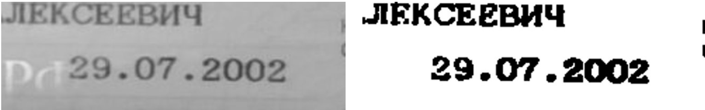

# A system for scanning QR codes about vaccination and reading information from the passport, determining its authenticity

Student project 2022, during the period of relevance of QR codes about vaccination.
The goal of the project is to read information from a QR code, compare it with the data in the passport, and verify the authenticity of the document.
The authenticity of the passport is checked using ultraviolet LEDs.

The left column is a passport printed on a piece of paper, the right column is a real passport:

Information from the passport — last name, first name, patronymic and date of birth — is read using a special algorithm that determines the position of the eyes in the photo. The image sections are then filtered and transmitted to the optical character recognition system.

Blocks with information from passport:

Blocks with information from passport:

